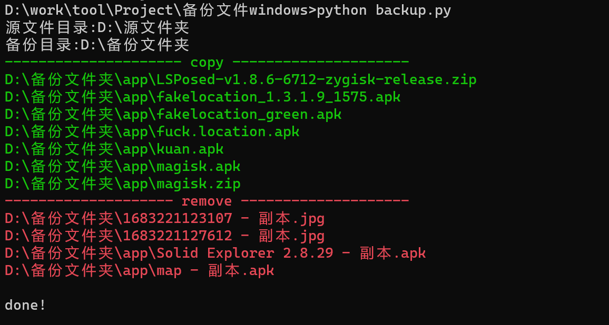

# backup.py

backup.py 是一款**差量备份**程序，备份文件从一个目录到另一个目录。

（源目录内容不会改变，复制文件到备份目录或从备份目录删除，使备份目录下的内容与源目录一致）


backup_justcopy.py 为**增量备份**。

（源目录内容不会改变，复制文件到备份目录，备份目录下只会增加文件不会删除文件）


## 安装：

python3


## 工作流程：

对比两个目录下的文件，若文件名相同文件、修改日期不同则复制替换文件；

若存在源目录有，但备份目录没有的文件，则复制到备份文件夹；

若存在备份目录有，但源目录没有的文件，则删除备份文件。


## 使用：

```
python backup.py
源文件目录:
备份目录:
```

绿色为复制从源文件夹复制到备份文件夹的文件，红色为从备份文件夹删除的文件




## 注意事项：

linux下使用，请将31行的'\\\\'换成'//'

支持备份黑名单，可输入文件名到blacklist1、输入文件后缀到blacklist2

```
blacklist1=["desktop.ini"]
blacklist2=[".pyc",".log"]
```

